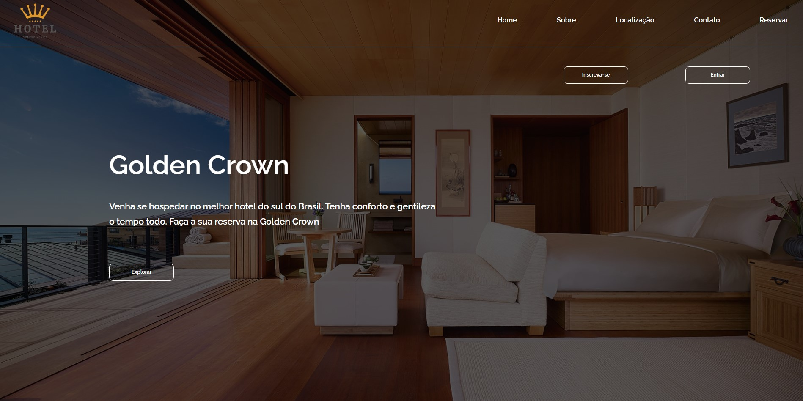
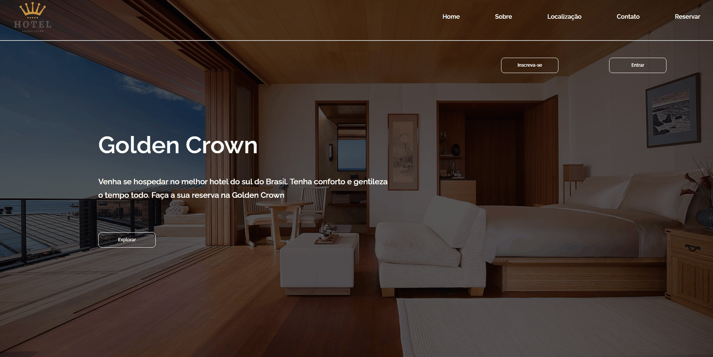

<h1 align='center'> Página Inicial de um Hotel de Luxo </h1>

 

 O projeto consiste em simular a página inicial de um hotel de luxo 

 

 Abaixo podemos ter uma ilustração das funcionalidades da página

 

 

<h2>Tecnologias:</h2>

 

 Para a realização do projeto foram utilizadas as seguintes tecnologias. 

<ul>
    <li> JavaScript </li>
    <li> HTML 5 </li>
    <li> CSS 3 </li>
</ul>

Contribuidor do projeto - (Diógenes Ribeiro de Oliveira) - [Visit my Linkedin](https://www.linkedin.com/in/diogenesriboliveira/)

